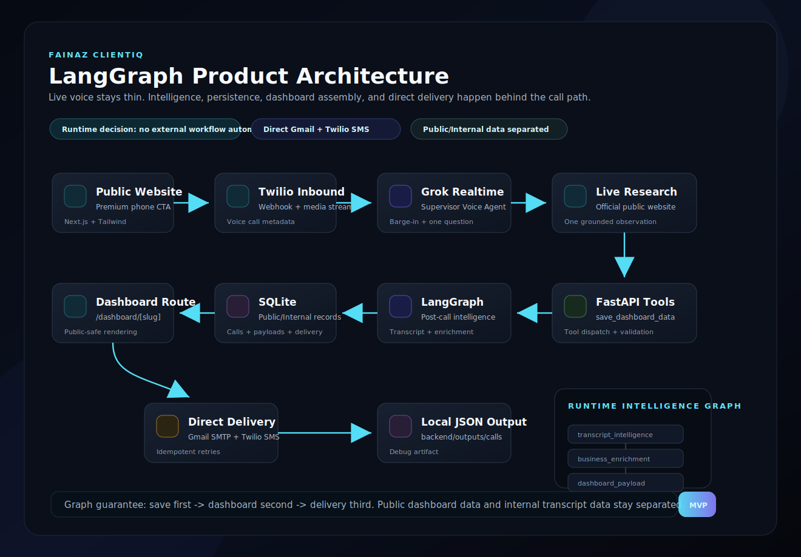
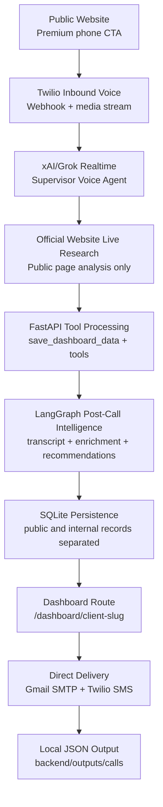
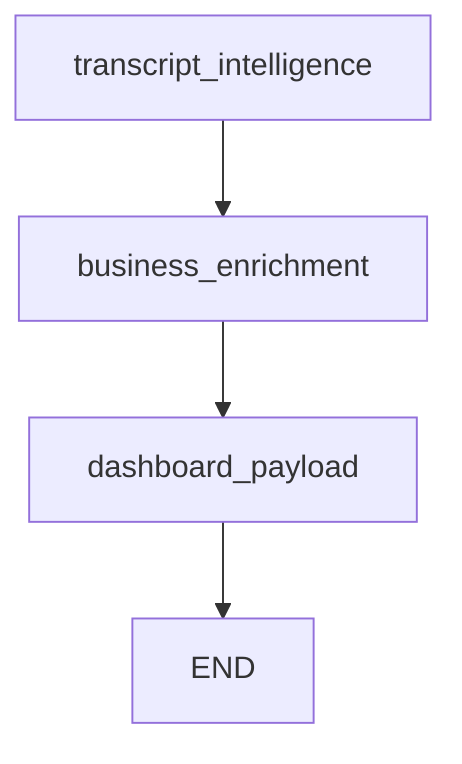

# Fainaz ClientIQ LangGraph Architecture

This document shows the current end-to-end architecture as a LangGraph-style flow.

Runtime rule: this graph describes the product architecture. The live call path must stay thin; heavy intelligence runs behind the live voice layer.





## LangGraph Modules

Backend graph files:

- `backend/app/graph/workflow.py`  
  Runtime intelligence graph used by save/transcript flows.

- `backend/app/graph/architecture.py`  
  Project architecture graph used for planning, documentation, and architecture validation.

## Runtime Intelligence Graph



## Project Architecture Graph Nodes

1. `public_website`
2. `twilio_inbound`
3. `realtime_voice`
4. `live_research`
5. `backend_tools`
6. `intelligence_workflow`
7. `sqlite_persistence`
8. `dashboard_route`
9. `direct_delivery`
10. `local_output`

## Validation Command

From `backend`:

```powershell
@'
from app.graph.architecture import run_project_architecture_graph

result = run_project_architecture_graph()
print(result["stage_log"])
print("dashboard_ready:", result["public_dashboard_ready"])
print("internal_ready:", result["internal_record_ready"])
print("delivery_ready:", result["delivery_ready"])
'@ | .\.venv\Scripts\python.exe -
```
